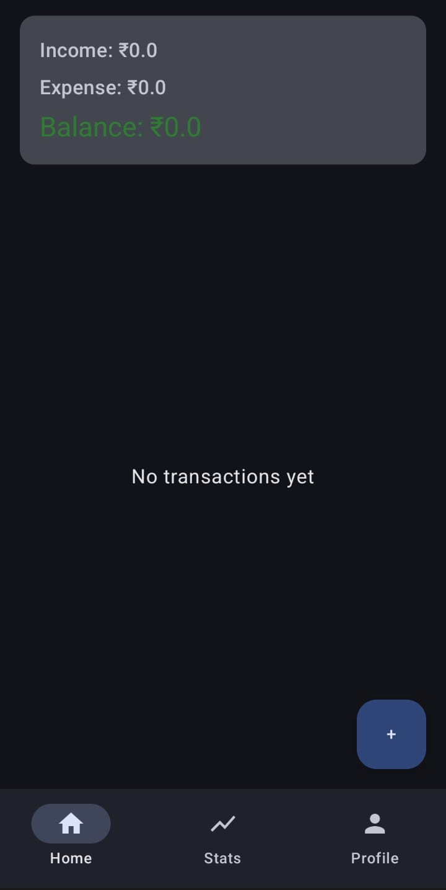
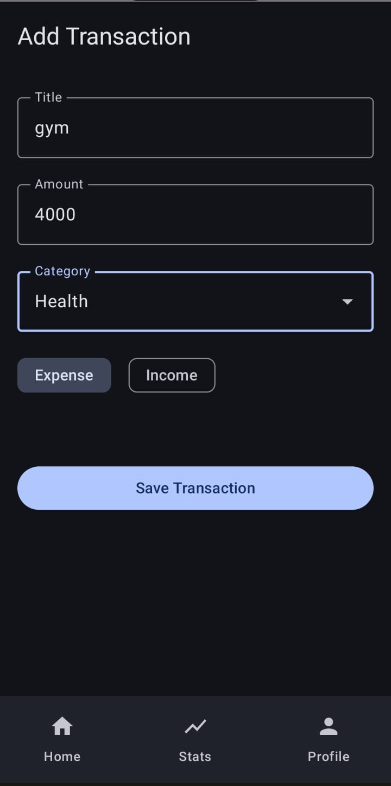
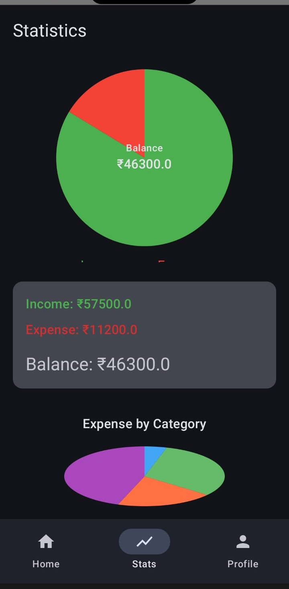
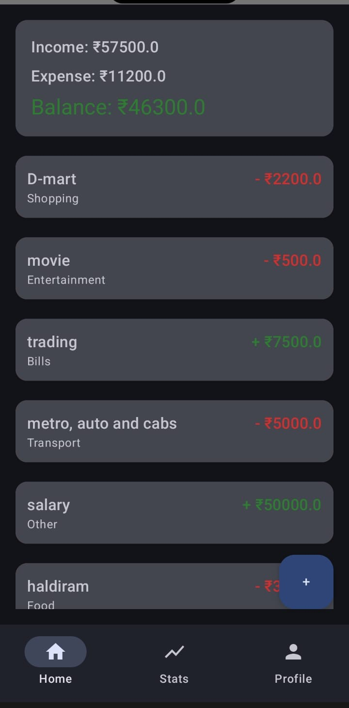
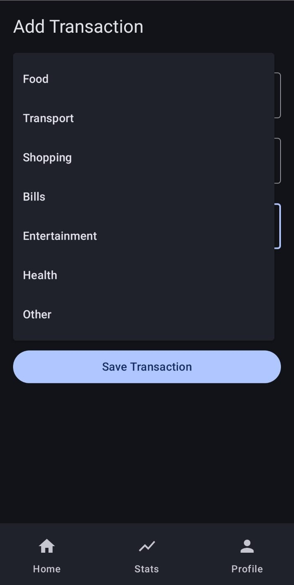

# 💰 SpendIQ – Smart Expense Tracker App

SpendIQ is a modern Android application built using Jetpack Compose that helps users efficiently track and manage their daily expenses. It provides a clean and intuitive interface to add, edit, and categorize transactions, making personal finance management simple and organized.

The app follows modern Android development practices with a scalable MVVM architecture, delivering a smooth and responsive user experience. SpendIQ also provides meaningful insights into spending patterns, helping users make smarter financial decisions.

---

## 🚀 Features

* 📊 Track and categorize expenses
* ➕ Add, edit, and delete transactions
* 🔍 Search and filter functionality
* 📈 Visual insights and summaries
* 🌙 Dark mode support
* ⚡ Built with Jetpack Compose for modern UI

---

## 🛠 Tech Stack

* **Language:** Kotlin
* **UI:** Jetpack Compose
* **Architecture:** MVVM
* **Database:** Room Database / Firebase
* **Tools:** Android Studio

---

## 📱 Screenshots

<p align="center">
  
  
  
</p>

<p align="center">
  
  
</p>

---

## 📂 Project Structure

```bash
app/
 ┣ data/          # Data layer (Room DB, models)
 ┣ ui/            # Compose UI screens
 ┣ viewmodel/     # ViewModels (MVVM)
 ┗ utils/         # Helper classes
```

---

## ⚙️ Installation

1. Clone the repository

```bash
git clone https://github.com/your-username/SpendIQ.git
```

2. Open in Android Studio

3. Build & Run the app

---

## 🎯 Future Improvements

* 📅 Monthly/Yearly reports
* ☁️ Cloud sync (Firebase)
* 🔔 Expense reminders
* 📊 Advanced analytics

---

## 👨‍💻 Author

**Virat Jaiswal**
Android Developer | Kotlin | Jetpack Compose

---

## ⭐ Show Your Support

If you like this project, give it a ⭐ on GitHub!
